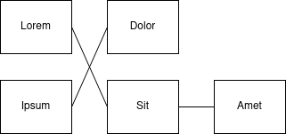

# DF Designer Frontend Vacancy - Coding Challenge

Your task will be to write a React based application, either in TypeScript or JavaScript (altough the former will be preferred). The application should:

1. Fetch a list of available graphs from `/api/graphs` via a `GET` request.
2. Fetch the selected graph data in JSON format from `/api/graphs/:id` via a `GET` request.
3. Organize nodes into columns.
4. "Untangle" the connection between the columns of nodes.
5. Render the graph

For more details, read through the readme.

## Getting started

 1. Clone this repository
 2. `cd df_designer_frontend_test && npm install`
 3. (Optional) If you prefer to use JS, change `src/*.tsx` to `src/*.jsx` and change `src="/src/main.tsx"` in `index.html` to `src="/src/main.jsx"`
 4. Run `npm start` to run the dev server
 5. Write your app in `src/App.{tsx,jsx}`
 6. Run `npm test` to see if your solution passes the test suite


## Checklist

 - [ ] There is a way to select from all the available graphs (eg. a dropdown)
 - [ ] The selected graph is immediately rendered
 - [ ] The renderd graph is organized into columns
 - [ ] The nodes in columns are ordered such that their edges cross as little as possible
 - [ ] The graph looks nice
 - [ ] **Your solution passes the test suite** (`npm test`)

## The API and the data format

The `/api/graphs` endpoint list a number of (predefined) graphs in this JSON format:

```json
{
  "graphs": [
    0, 1, 2, ...
  ]
}
```

The `/api/graphs/:id` endpoint returns a JSON document with the following structure:

```typescript
interface Graph {
  // Feel free to split these out into separate interfaces
  nodes: { id: string; name: string }[];
  edges: { fromId: string; toId: string }[];
}
```

Fields:

- Nodes:
  - `id`: Unique id of the node
  - `name`: String name of the node which should be displayed
- Edges:
  - `fromId`: Id of the node from which the edge starts
  - `toId`: Id of the node to which the edge leads

**Note:** The endpoint may return a different graph on each request. Your application should only make a single request, but you may add a button to render a new graph.

## Graph layout

Your application should compute a layout for the received graph.

 1. First, you should organize the nodes into separate columns

 2. Next, you should reorder nodes within columns such that the edges between them cross each other as little as possible.


Ideally, you should implement the layout inside one or more custom React hook.

## Graph rendering

You should display the layouted graph in the DOM. 
 - You may simply use `div`s for the nodes and render the edges with SVG, for example. 
 - You should use CSS to make the graph look as nice as possible.
 - **Important** attach a `data-id` attribute to each node `div` which contains that node's id from the original JSON.


## Extra challenge

Make the nodes draggable with the mouse without using a library.

